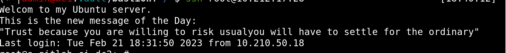

.



# Webhook service

Service written in Golang for interract as webhook server for MinIO storage.


## Table of Contents
- Requirements
- Configuration
    - Environment variables
- Install
    - Clone this repository
    - Edit settings
- Run the app
    - The Docker way
- Healthcheck API
  - Liveness and Readiness Probe


## Requirements
- [go 1.7](https://go.dev/doc/go1.7)
- [Whitelist service](https://stash.p67.btkprb.com/projects/PROJECT67/repos/minio-rabbitmq-bee2/browse/minio-go-whitelist)
- [MinIO](https://min.io)
- [Docker](https://docker.com)

## Configuration

### Environment variables

| Variable | Required | Description                                                            | Default Value |
| ------ |----------|------------------------------------------------------------------------| ----- |
| CONFIG_FILE | false    | The path to the config file provided by Vault.                         | - |
| DEBUG | false    | Enable or disable the debug mode.                                      | false |
| SERVER_PORT | false    | The port number for the server to listen on.                           | 9090 |
| SERVER_AUTH_TOKEN | true     | This is a string which acts as the authentication of the MinIO webhook | - |
| SERVER_ALLOW_LIST | false    | Comma separated ip addresses                                           | - |
| QUEUE_DIR | true     | The directory for store undelevered events                             | /tmp/events |
| MINIO_SRC_ENDPOINT | false    | ip address or domain name                                              | 10.5.0.3:9000 |
| MINIO_SRC_ACCESS | false    | access key                                                             | minioadmin |
| MINIO_SRC_SECRET | false    | secret key                                                             | minioadmin |
| MINIO_SRC_USE_SSL | false    | use https or not                                                       | false |
| MINIO_DEST_ENDPOINT | false    | ip address or domain name                                              | 10.5.0.3:9000 |
| MINIO_DEST_ACCESS | false    | access key                                                             | minioadmin |
| MINIO_DEST_SECRET | false    | secret key                                                             | minioadmin |
| MINIO_DEST_USE_SSL | false    | use https or not                                                       | false |
| MINIO_DEST_ADDITIONAL_TAGS | false    | -                                                                      | published:true |
| ASSETS_WHITELIST_URL | false    | whitelist endpoint                                                     | http://10.5.0.6:8080 |
| PROXY_WOWZA_HOST | true    | proxy wowza host                                                     | http://10.5.0.8:8080 |


## Install

### Clone this repository
```bash
$ git clone https://stash.p67.btkprb.com/scm/project67/minio-rabbitmq-bee2.git

# Go into the folder
$ cd minio-go-notifications
```

### Edit settings

Then create ``.env`` file form the sample and edit:
```bash
cp ./internal/config/.env.sample .env
```

Also, you can put the path to the config file via ``CONFIG_FILE`` environment variable

## Run the app

### The Docker way

use docker-compose with whitelist, minio source and destination services:

```bash
docker-compose up
```