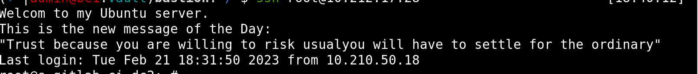

# 1. Change MOTD on VM



## How it do

### Turn off default MOTD
```bash
$ vi /etc/default/motd-news

# Turn off default MOTD
$ ENABLED=0
```
### Edit settings

Then create ``.env`` file form the sample and edit:
```bash
cp ./internal/config/.env.sample .env
```

# 2. Define the exact kernel version


### command
```bash
$ uname -srm
# or
$ hostnamectl | grep -i "kernel"
```

# 3. Define the exact kernel version


### command
```bash
$ uname -srm
# or
$ hostnamectl | grep -i "kernel"
```